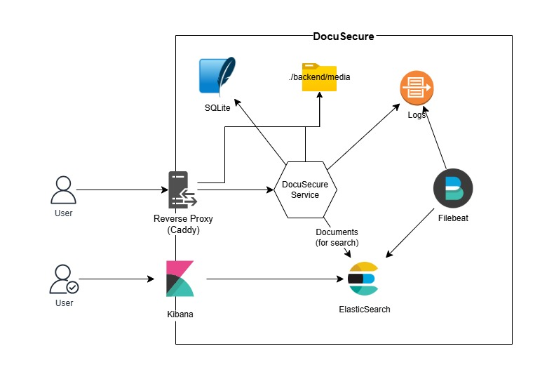

# Case Study

## Django

A lot of the decisions where made with the tight timeline in mind. This is one
of those decisions.

I didn't work with Django directly before, the only thing I knew that it's
batteries included. After some research I figured that it'll be perfect for
this project. It has built-in auth and there's elasticsearch library.

## PKI Traefik and Caddy

I had previous exprience with Nginx and Let's Encrypt. I heard about Traefik
and Caddy. For some context, I'm developing inside NixOS in WSL. At first I
tried to Work with Traefik, I wasn't able to get it, it started to take alot of
time so I had to move, and I knew that Caddy was easier.

Caddy was easier to configure and to use it as a reverse proxy and to generate
certs. I had a problem with configuring the certificates due to WSL setup. It's
working as a reverse proxy for now.

## ElasticSearch, Filebeat, and Kibana

It was obvious that the EFK stack was the way to go. ElasticSearch was needed to
conveniently use as a search engine for the documents. And while I had ES setup,
I dicided to use Filebeat to Sync the logs from the Djongo app to ES. And to search
and preview the logs (and docs) I used Kibana.
